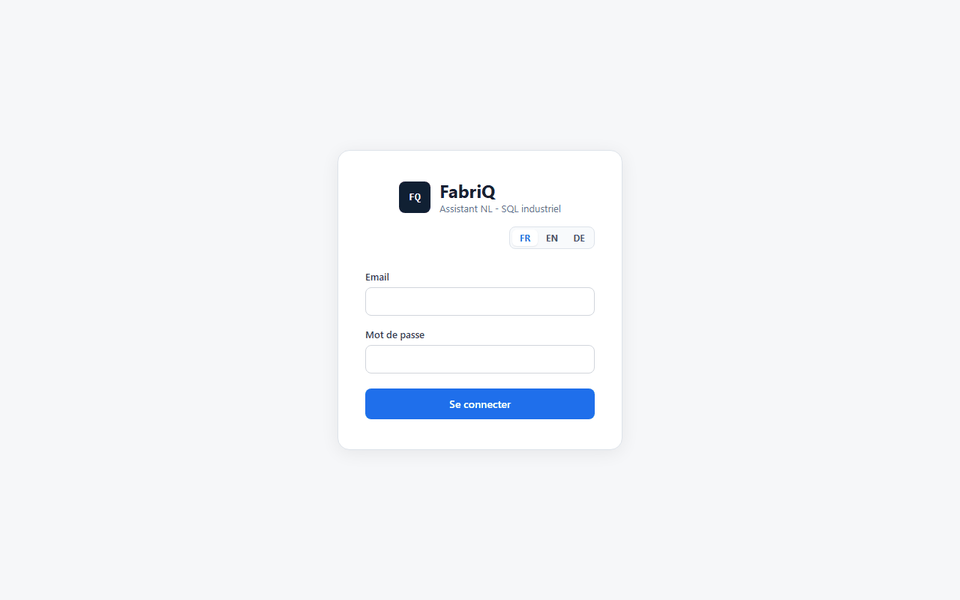

# FabriQ

[](https://github.com/Lassoued1/FabriQ/actions/workflows/ci.yml)

> **Portfolio Notice**
> This repository is a demonstrative, standalone build shared for portfolio purposes. It showcases architecture, technical decisions, and code quality. The database is an industrial demo dataset, not a client database.

FabriQ is an analytics assistant for industrial SMEs: ask a question in natural language, get a safe SQL query, executed read-only, then a readable answer with table, chart, visible SQL, and an operational explanation.

**Current version: v0.15.0** — natural-language questions in French, German and English driving parameterized queries, an SQL guardrail backed by a read-only database role, multi-user, multi-tenant, optional OIDC SSO (Keycloak), LangGraph orchestration, scheduled alerts, generic outgoing webhooks (HMAC-signed, SSRF-guarded), a trilingual FR/EN/DE interface (login page included, language persisted), Prometheus/Grafana observability, CI and E2E tests.



## Problem

In an industrial SME, production, stock, sales, supplier, returns, and logistics data often stays locked inside relational databases. Business users need fast answers without writing SQL and without risking any modification to the database.

FabriQ turns a business question into a validated SQL query, executes that query read-only, then returns a result that is understandable and auditable.

## Design principles

- **The LLM proposes, the code decides.** The optional local LLM (Ollama) only acts as an intent router, as a fallback to the deterministic router. It never generates SQL directly.
- **No writes to the database, ever.** A dedicated read-only PostgreSQL role, backed by an application-level validation layer. A successful prompt injection cannot write, because the role has no write permission.
- **Everything is transparent.** The SQL, the orchestration trace, and the business explanation are visible in every response.
- **Accuracy is measured by execution result, not by SQL text similarity.** Two syntactically different queries can return the same correct result — a string comparison would have scored systematically wrong.

## Feature overview

- **Analytics core** — natural-language questions, a hybrid deterministic/LLM-assisted router, a semantic layer covering 13 families of industrial questions (margin, stockouts, supplier delays, production, revenue, inventory, logistics, returns, return reasons, customers, regions, average order value, anomalies), and business-readable answers with tables and charts.
- **Multi-user & security** — JWT authentication, multi-tenant data isolation, role-based access (admin/user), rate limiting.
- **Alerts & observability** — scheduled alert rules with webhook/Slack/email notifications, a filterable audit log with CSV/Excel export, Prometheus metrics, and a provisioned Grafana dashboard.
- **Quality** — a layered test suite and a dedicated evaluation harness, both running in CI on every push (see below).

## Evaluation

Correctness is measured against a purpose-built harness — **four suites, 95 cases, all passing**:

| Suite | Result | Purpose |
|---|---|---|
| Golden | 49/49 | Curated reference questions with known-correct results. Baseline accuracy. |
| Paraphrases | 10/10 | Same business questions, reworded. Robustness against phrasing variance. |
| German | 18/18 | German-language questions against the same data. |
| English | 18/18 | English-language questions against the same data. |

Each report records, per case: the generated SQL, the detected intent, the row count, and the selected chart type — so a failure shows *why*, not just that it failed.

**Tests:** 126 backend tests (pytest), frontend unit tests (Vitest), and Playwright E2E suites (auth, analysis, observability, SSO against a committed OIDC stub). CI runs backend (pytest + ruff), frontend (tsc + build), a Docker smoke test, and E2E on every push. Load testing with Locust.

## Architecture

Full schema and technical decisions are detailed in [docs/ARCHITECTURE.md](docs/ARCHITECTURE.md).

```text
User
  -> React/Vite frontend (JWT auth, chat, charts, admin/alerts/audit panels)
  -> FastAPI (rate limiting, multi-tenant)
  -> LangGraph graph (routing -> SQL template -> validation -> execution -> response)
  -> SQL guard + read-only PostgreSQL role
  -> Response + chart + orchestration trace + audit log
  -> Prometheus / Grafana
```

## Quick start (Docker Compose)

```bash
git clone https://github.com/Lassoued1/FabriQ.git
cd FabriQ
cp .env.example .env
docker compose up -d
```

The frontend, API, and observability stack (Prometheus/Grafana) come up together. Interactive OpenAPI documentation is served at `/docs` on the running API.

## Tech stack

| Layer | Technology |
|---|---|
| Frontend | React 19, Vite, TypeScript |
| Backend | Python, FastAPI |
| Orchestration | LangGraph |
| Database | PostgreSQL (read-only application role), SQLite for local dev/test |
| Observability | Prometheus, Grafana |
| Containerization | Docker Compose |
| CI | GitHub Actions (backend, frontend, Docker smoke test, E2E) |

## Explicit limitations

- The database is an industrial demo dataset, not a client database.
- No PDF ingestion or document RAG, no fine-tuning.
- Ollama remains optional and local; the default behaviour is fully deterministic and works without any LLM.
- The SQL guardrail is application-level (allowlist + validation) backed by the read-only role; a formal AST parser and EXPLAIN-based validation remain planned improvements.
- Users are declared via environment variables (no external SSO/OAuth2 yet).

## Roadmap

See [docs/ROADMAP.md](docs/ROADMAP.md) for planned improvements, and [CHANGELOG.md](CHANGELOG.md) for version history.

---

*Detailed operational documentation (full API reference, environment configuration, evaluation tooling) is maintained privately. Feel free to reach out if you'd like to discuss the implementation in more depth.*
